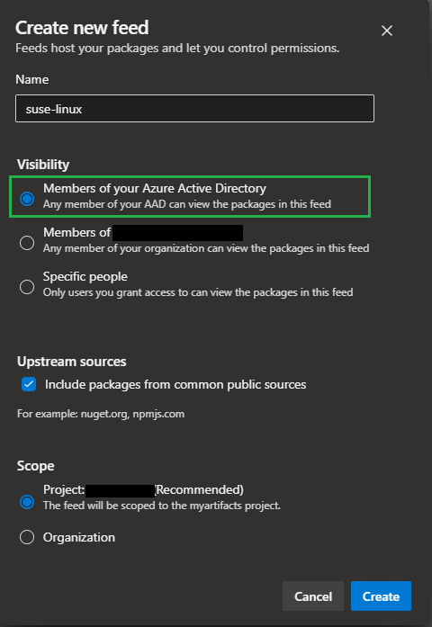

# Azure VM: SLES + Docker + Azure Artifacts

SUSE Linux Enterprise Server deployment with Docker Compose on Azure VMs.

## Deployment

Generate the temporary keys to be used:

```sh
ssh-keygen -f modules/suse/id_rsa
```

Create the `.auto.tfvars` file from the template:

```sh
# Choose your distro
cp templates/suse(15|12).auto.tfvars .auto.tfvars
```

Create the resources:

```sh
terraform init
terraform apply -auto-approve
```

Connect to the virtual machine:

```sh
ssh -i modules/suse/id_rsa suseadmin@<<PUBLIC-IP>>
```

Check `cloud-init`:

```sh
cloud-init status
```

## Azure Artifacts

### Azure DevOps setup

Create an Artifact Feed of type Universal Packages in an ADO project.

> 💡 For practical implementation of this projects, it is possible to select all members. However, implement minimal privilege in production.



You must give [`Contributor`][1] permissions for the pipeline to publish packages. Check the [Pipelines permissions][2] sections for more information.

Now create a pipeline on ADO using [azure-pipeline.yaml](./azure-pipeline.yaml) as a template. Add the variables `projectName` and `feedName` accordingly.

Run the pipeline and confirm that the artifact has been generated.


### VM access to ADO

Add the VM System-Assigned identity to Azure DevOps.

When logged into the VM, login with the VM Managed Identity:

```sh
az login --identity --allow-no-subscriptions
```

The Azure DevOps Extension for the CLI is already installed via `userdata`.

It is necessary to run additional commands to allow a Managed Identity to connect to Azure DevOps. Follow the [documentation][3] to implemented that.


---

### Clean-up

```
terraform destroy -auto-approve
```


[1]: https://learn.microsoft.com/en-us/azure/devops/artifacts/feeds/feed-permissions?view=azure-devops#permissions-table
[2]: https://learn.microsoft.com/en-us/azure/devops/artifacts/feeds/feed-permissions?view=azure-devops#pipelines-permissions
[3]: https://learn.microsoft.com/en-us/azure/devops/integrate/get-started/authentication/service-principal-managed-identity?view=azure-devops#q-can-i-use-a-service-principal-or-managed-identity-with-azure-cli
