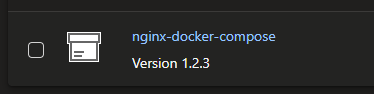
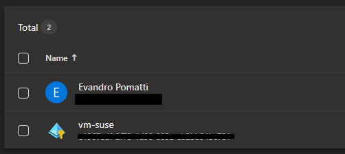

# Azure VM: SLES + Docker + Azure Artifacts

SUSE Linux Enterprise Server deployment with Docker Compose on Azure VMs.

## Deployment

Generate the temporary keys to be used:

```sh
ssh-keygen -f modules/suse/id_rsa
```

Create the `.auto.tfvars` file from the template:

```sh
# Choose your distro
cp templates/suse(15|12).auto.tfvars .auto.tfvars
```

Set the `subscription_id` and the `allowed_public_ips` variables.

> [!TIP]
> Check for available updates to packages installed via `cloud-init` and update the scripts.

Create the resources:

```sh
terraform init
terraform apply -auto-approve
```

Connect to the virtual machine:

```sh
ssh -i modules/suse/id_rsa suseadmin@<<PUBLIC-IP>>
```

Check `cloud-init`:

```sh
cloud-init status
```

## Azure Artifacts

### Azure DevOps setup

Create an Artifact Feed of type Universal Packages in an ADO project.

> 💡 For practical implementation of this project, it is possible to select all members. However, implement minimal privilege in production.


You must give [`Contributor`][1] permissions for the pipeline to publish packages. Check the [Pipelines permissions][2] sections for more information.

Now create a pipeline on ADO using [azure-pipeline.yaml](./azure-pipeline.yaml) as a template. Add the variables `projectName` and `feedName` accordingly.

Run the pipeline and confirm that the artifact has been generated.



### VM access to ADO

Add the VM System-Assigned identity to Azure DevOps.

When logged into the VM, login with the VM Managed Identity:

```sh
az login --identity --allow-no-subscriptions
```

The Azure DevOps Extension for the CLI is already installed via `userdata`.

It is necessary to run additional commands to allow a Managed Identity to connect to Azure DevOps. Follow the [documentation][3] to implemented that.

### Universal packages

Configuration will be performed with the [Azure CLI DevOps extension][19].

#### Interactive login

Preferably for this operation, use the interactive Azure CLI login:

```sh
az login
```

Optionally, this can also be set:

```sh
az devops configure --defaults organization=<your-org-url> project=<your-project-name>
```

#### Service principal login

It is possible to connect from the VM to ADO using Managed Identities with a [connected tenant][18].



To login with such identity, use a variation of the `az login` command:

```sh
az login --identity --allow-no-subscriptions
```

### Upstream sources

Using [upstream sources][16] it is possible to store packages from various sources in a single feed.

Follow the procure on how to [set up upstream sources][17] for this configuration.

> [!TIP]
> If you don't need all of the upstream sources, remove them from the feed.

The requirements for this approach (using Maven) are:

- Java 
- Maven
- Personal Access Token (PAT) with minimal permissions
- Maven `settings.xml` setup

The Maven `settings.xml` configuration should look like this:

```xml
<servers>
    <server>
        <id>azure-devops-feed-id</id>
        <username>anything</username>
        <password>YOUR_PERSONAL_ACCESS_TOKEN</password>
    </server>
</servers>
```

Set the `-DrepoUrl` value, and run the command:

```sh
mvn dependency:get \
    -DrepoUrl=<repository-url> \
    -Dartifact="com.microsoft.sqlserver:mssql-jdbc:12.8.1.jre11" \
```

The downloaded JAR will be available at the `~/.m2/repository` location.


## CNI

To enable containers with advanced features, such as service endpoints, you need the [CNI][4].

More information on how to [deploy][5] the plugin and the [project][6] on GitHub.

## Crontab (SUSE 12)

Following [tutorial 1][7] and [tutorial 2][8], install Nginx.

> [!NOTE]
> This was tested on SUSE 12 only

Prepare the installation:

```sh
sudo zypper addrepo -G -t yum -c 'http://nginx.org/packages/sles/12' nginx
wget http://nginx.org/keys/nginx_signing.key
sudo rpm --import nginx_signing.key
```

Install Nginx:

```sh
sudo zypper install nginx
```

Commands to control Nginx:

```sh
sudo systemctl start nginx
sudo systemctl restart nginx
sudo systemctl stop nginx
sudo systemctl status nginx
```

Instead of enabling the service directly, let's configure a `crontab`.

Create a file named `/opt/start-nginx.sh`:

```sh
echo "Starting NGINX"
sudo systemctl start nginx
echo "Completed starting NGINX"
```

Add the required permissions:

```sh
chmod +x /opt/start-nginx.sh
```

Edit the `crontab`:

```sh
crontab -e
```

Set the script path:

```sh
@reboot /opt/start-nginx.sh
```

Crontab logs can be view with the journal:

```sh
journalctl --no-hostname --output=short-precise | grep -i cron
```

## Proxy

### DNS checking

Immediatelly using `dig` to resove the storage IP address should return a public IP granted by Private Link integration.

```sh
dig stsuse82913.blob.core.windows.net
```

It is also expected to resolve to the public IP using an external DNS.

```sh
dig @8.8.8.8 stsuse82913.blob.core.windows.net
```

### Get blob script

Copy the `getblob.sh` template file:

```sh
cp templates/getblob.sh getblob.sh
```

Edit the `storage_account` and `access_key` variables.

Test the script:

```sh
bash getblob.sh
```

### Proxy configuration

To force `curl` through a proxy, use the `-x` command:

> [!TIP]
> Once the proxy is set in Linux, `curl` will pickup the configuration automatically. To force no proxy, use the command `-noproxy`.

```sh
-x "http://43.153.208.148:3128"
```

Create a proxy for testing, or use a [free option][9].

> [!CAUTION]
> If using a free proxy, do not use real credentials while testing.

### Linux proxy

Proxy configuration can be global or single user ([SUSE documentation][10]).

For global `/etc/sysconfig/proxy`:

> [!IMPORTANT]
> For `NO_PROXY`, the wildcard character is `.`.

```sh
PROXY_ENABLED="yes"
HTTP_PROXY="http://43.153.208.148:3128"
HTTPS_PROXY="http://43.153.208.148:3128"
NO_PROXY="localhost, 127.0.0.1, .blob.core.windows.net"
```

For single user, such as in `.bashrc`:

```sh
export http_proxy="http://43.153.208.148:3128"
export https_proxy="http://43.153.208.148:3128"
export no_proxy="localhost, 127.0.0.1, .blob.core.windows.net"
```

### Proxy exceptions

When using private connections or trusted services, proxy exceptions can configured.

These are typically defined in "no proxy" configuration values.

For example, Microsoft Azure services connected via Private Link, such as `*.blob.core.windows.net` and `.azurecr.io`.

When using docker, consider the [AllowList][11]. Example: `hub.docker.com`, `registry-1.docker.io`, and `production.cloudflare.docker.com`.

### Docker proxy

Configuration can be done for the _CLI_ and for the _daemon_.

As it is stated in the [documentation][15], proxy-related environment variables are automatically copied:

> When you start a container, its proxy-related environment variables are set to reflect your proxy configuration in `~/.docker/config.json`

This could have unintended consequences when using wildwards.

> [!IMPORTANT]
> In the Docker configuration, the wildcard character is `*`. This can break the Linux proxy as it does not support wildcard with `*`, only starting with `.` will work.

For the [CLI][12] on file `~/.docker/config.json`:

```json
{
 "proxies": {
   "default": {
     "httpProxy": "http://43.153.208.148:3128",
     "httpsProxy": "http://43.153.208.148:3128",
     "noProxy": "127.0.0.0/8,*.blob.core.windows.net,*.docker.com,*.docker.io,*.cloudflare.docker.com"
   }
 }
}
```

For the [daemon][12] on file `daemon.json`, of which the location [can vary][14]:

```json
{
  "proxies": {
    "http-proxy": "http://43.153.208.148:3128",
    "https-proxy": "http://43.153.208.148:3128",
    "no-proxy": "127.0.0.0/8,*.blob.core.windows.net,*.docker.com,*.docker.io,*.cloudflare.docker.com"
  }
}
```

After changing the configuration file, restart the daemon:

```sh
sudo systemctl restart docker
```

### Docker testing

You'll need to log in to Docker Hub.

> [!IMPORTANT]
> Prefer using a PAT for testing, and delete it later. Or use a custom proxy.

```sh
docker login -u <username>
```

Pull the image for testing:

```sh
docker pull ubuntu
```

Connect iteratively to the container:

```sh
# Run it
docker run -i -t ubuntu bash

# If needed, reconnect
docker start containername
docker attach containername
```

Install the required tools:

```sh
apt update && apt install -y dnsutils vim nano curl openssl
```

Test again using the [getblosh.sh](/templates/getblob.sh) script template.

---

### Clean-up

```
terraform destroy -auto-approve
```


[1]: https://learn.microsoft.com/en-us/azure/devops/artifacts/feeds/feed-permissions?view=azure-devops#permissions-table
[2]: https://learn.microsoft.com/en-us/azure/devops/artifacts/feeds/feed-permissions?view=azure-devops#pipelines-permissions
[3]: https://learn.microsoft.com/en-us/azure/devops/integrate/get-started/authentication/service-principal-managed-identity?view=azure-devops#q-can-i-use-a-service-principal-or-managed-identity-with-azure-cli
[4]: https://learn.microsoft.com/en-us/azure/virtual-network/container-networking-overview
[5]: https://learn.microsoft.com/en-us/azure/virtual-network/deploy-container-networking#download-and-install-the-plug-in
[6]: https://github.com/Azure/azure-container-networking?tab=readme-ov-file
[7]: https://www.cyberciti.biz/faq/install-and-use-nginx-on-opensuse-linux/
[8]: https://www.cyberciti.biz/faq/how-to-install-nginx-on-suse-linux-enterprise-server-12/
[9]: https://hide.mn/en/proxy-list/
[10]: https://www.suse.com/support/kb/doc/?id=000017441
[11]: https://docs.docker.com/desktop/allow-list/
[12]: https://docs.docker.com/engine/cli/proxy/
[13]: https://docs.docker.com/engine/daemon/proxy/
[14]: https://docs.docker.com/engine/daemon/#configuration-file
[15]: https://docs.docker.com/engine/cli/proxy/#run-containers-with-a-proxy-configuration
[16]: https://learn.microsoft.com/en-us/azure/devops/artifacts/concepts/upstream-sources?view=azure-devops
[17]: https://learn.microsoft.com/en-us/azure/devops/artifacts/how-to/set-up-upstream-sources?view=azure-devops&tabs=maven
[18]: https://learn.microsoft.com/en-us/azure/devops/integrate/get-started/authentication/service-principal-managed-identity?view=azure-devops
[19]: https://learn.microsoft.com/en-us/azure/devops/cli/?view=azure-devops
